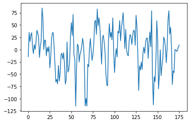

# Diagnosing Autism using individual brain regions from rs-fMRIs

**One Sentence Summary**
* This repository outlines the construction of a deep linear neural network used to classify patients with autism using regional brain activity from functional MRIs gathered at rest (rs-fMRIs); patient data will be gathered from the ABIDE dataset. 

## Overview

* The task is to use several patients’ rs-fMRIs, convert them individually into time series of 48 features using the Harvard-Oxford Cortical Structural Atlas, and train deep linear neural networks for several pertinent regions to produce a regression result; namely, these results will be a probability of whether each individual patient has Autism Spectrum Disorder (ASD).  
* Summary of the performance achieved: TBD 

### Motivation and Background

* I was assigned this project as part of my undergraduate and graduate research under Dr. Pedro Maia at UTA. It sounded like an interesting project to work on, especially since I also have ASD. 

* Previous works:
  * [Identification of autism spectrum disorder using deep learning and the ABIDE dataset - PubMed](https://pubmed.ncbi.nlm.nih.gov/29034163/)
  * [Disease prediction using graph convolutional networks: Application to Autism Spectrum Disorder and Alzheimer’s disease - ScienceDirect](https://www.sciencedirect.com/science/article/abs/pii/S1361841518303554)
  * [Enhancing studies of the connectome in autism using the autism brain imaging data exchange II | Scientific Data](https://www.nature.com/articles/sdata201710)
* This appears to be a previous work that I plan on extending using several different models. 

## Summary of Work Done

### Data

* Source: downloaded through Nilearn, also available through [this link](http://fcon_1000.projects.nitrc.org/indi/abide/abide_II.html) via the Neuroimaging Informatics Tools and Resources Clearinghouse ([NITRC](http://nitrc.org)).
* Type: NII or NII.GZ files
  * Input: time series for individual brain regions, as outlined in the Preprocessing / Clean-up section
* Size: ~100 GB, although it is ~100 MB per file
* Instances (Train, Test, Validation Split): how many data points? Ex: 1000 patients for training, 200 for testing, none for validation

#### Preprocessing / Clean up

* In order to fully process the data, I had to run it through a masker, which is the name Nilearn gives to its class of objects that can transform raw Nifti objects into Numpy arrays.

#### Data Visualization

The activity in the orbitofrontal cortex of one particular patient.

### Problem Formulation

* Input: time series gathered from masker, as detailed in preprocessing
* Models (Will try)
    * Running a DNN through PyTorch. This allows for easier GPU usage.
* The loss function will just be accuracy, considering that this is just a binary classification; precision, recall, and F1 will also be considered.

### Training

* I used Google Colab to load the data, code the model, and save the model for further use.
* How did training take.
* Training curves (loss vs epoch for test/train).
* How did you decide to stop training.
* Any difficulties? How did you resolve them?

### Performance Comparison

* Clearly define the key performance metric(s).
* Show/compare results in one table.
* Show one (or few) visualization(s) of results, for example ROC curves.

### Conclusions

* State any conclusions you can infer from your work. Example: LSTM work better than GRU.

### Future Work

* What would be the next thing that you would try.
* What are some other studies that can be done starting from here.

## How to reproduce results

* In this section, provide instructions at least one of the following:
   * Reproduce your results fully, including training.
   * Apply this package to other data. For example, how to use the model you trained.
   * Use this package to perform their own study.
* Also describe what resources to use for this package, if appropirate. For example, point them to Collab and TPUs.

### Overview of files in repository

* [Nilearn_fMRI.ipynb](https://github.com/j4yb1rd/DATA4380-IndividualProject/blob/main/Nilearn_fMRI.ipynb): The current notebook I am working in.
* More notebooks and files will be added as more progress is made.

* Note that all of these notebooks should contain enough text for someone to understand what is happening.

### Software Setup
* One of the prominent packages involved in this project is Nilearn, a package of Python that specailizes in providing statistical methods to analyze brain volumes and scans.
* These packages may be installed via `pip` or `pip3` in your local Python terminal or within a Jupyter notebook.
  * Running the commands `!pip install nilearn` and `!pip install torch` will install these easily within your notebook. 

### Data

* Point to where they can download the data.
* Lead them through preprocessing steps, if necessary.

### Training

* Describe how to train the model

#### Performance Evaluation

* Describe how to run the performance evaluation.

## Citations

* Provide any references.

