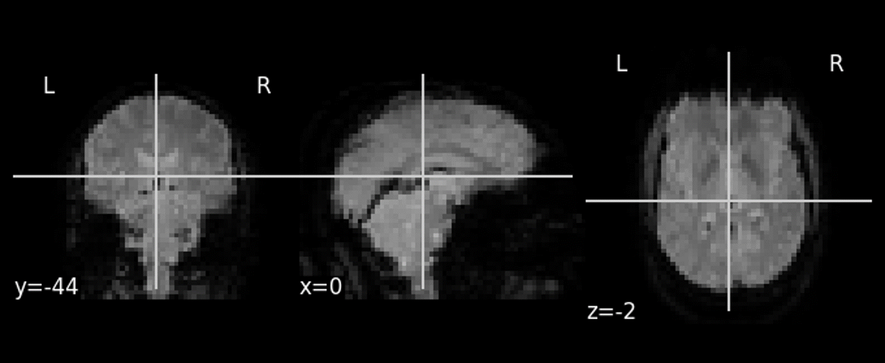

# Diagnosing Autism using individual brain regions from rs-fMRIs

**One Sentence Summary**
* This repository outlines the construction of a deep linear neural network used to classify patients with autism using regional brain activity from functional MRIs gathered at rest (rs-fMRIs); patient data will be gathered from the ABIDE dataset. 

## Overview

* The task was to use several patients’ rs-fMRIs, convert them individually into time series of 48 features using the Harvard-Oxford Cortical Structural Atlas, and train deep linear neural networks for several pertinent regions to produce a regression result; namely, these results would be a probability of whether each individual patient has Autism Spectrum Disorder (ASD).  
* Only the orbitofronal cortex was considered for a small selection of 80 patients from NYU.
* Summary of the performance achieved:  Results from training a model on the OFC time series indicate an accuracy of up to 81%, but through many simulations appear no better than random.

### Motivation and Background

* I was assigned this project as part of my undergraduate and graduate research under Dr. Pedro Maia at UTA. It sounded like an interesting project to work on, especially since I also have ASD. 

* Previous works:
  * [Identification of autism spectrum disorder using deep learning and the ABIDE dataset - PubMed](https://pubmed.ncbi.nlm.nih.gov/29034163/)
  * [Disease prediction using graph convolutional networks: Application to Autism Spectrum Disorder and Alzheimer’s disease - ScienceDirect](https://www.sciencedirect.com/science/article/abs/pii/S1361841518303554)
  * [Enhancing studies of the connectome in autism using the autism brain imaging data exchange II | Scientific Data](https://www.nature.com/articles/sdata201710)
* This appears to be a previous work that I plan on extending using several different models. 

## Summary of Work Done

### Data

* Source: downloaded through Nilearn, also available through [this link](http://fcon_1000.projects.nitrc.org/indi/abide/abide_II.html) via the Neuroimaging Informatics Tools and Resources Clearinghouse ([NITRC](http://nitrc.org)).
* Type: NII or NII.GZ files
  * Input: time series for individual brain regions, as outlined in the Preprocessing / Clean-up section
* Size: ~100 GB, although it is ~100 MB per file
* Instances: 80 patients through NYU; 64 used for training , 16 for testing
  * Selection size of about 8 GB

#### Preprocessing / Clean up

* In order to fully process the data, I had to run it through a masker, which is the name Nilearn gives to its class of objects that can transform raw Nifti objects into Numpy arrays. Then, I stored these 2D Numpy arrays as CSVs so that they could be called later.

#### Data Visualization

The activity in the orbitofrontal cortex of one patient. The x-axis is the number of each individual time step, and the y-axis represents the unnormalized blood flow in that brain region.

Three cross-sections of one slice of an rs-fMRI. Views for y = -44, x = 0, and z = -2.

### Problem Formulation

* Input: time series gathered from masker, as detailed in preprocessing
* Models:
    * Running a DNN through sklearn.
* The metric was accuracy, considering that this is just a binary classification; precision and recall were also to be considered.

### Training

* I used Google Colab to load the data, code the model, and save the model for further use.
* I trained 1000 simulations of one MLP model.
  * Hidden Layers: (30,15,5,)
  * Solver: Stochastic Gradient Descent
  * Activation: ReLU

### Conclusions

* Results from 1000 simulations of the classifier model showed a normal distribution around 50% accuracy, with a maximum accuracy of 81.25%.
* Precision and recall each showed similar results, with a maximum of 100% during many runs.
* The study was limited by a small sample size due to hardware limitations, and any sample size larger than 100 needs at least 32 GB of RAM to run, especially during the smoothing process.
* The dataset takes up over 100 GB of disk space storage, but using 80 patients took up only 8 GB that was able to be loaded into Google Colab, the working environment in which this study was done.

### Future Work

* Patients in this study were from only one center, and using patients from multiple brain scan centers as provided in the dataset may contribute to a higher accuracy.
* The utilization of the subcortical atlas could explore regions further embedded in the brain, such as the amygdala, which may contribute to a more successful model.

## How to reproduce results

* In this section, provide instructions at least one of the following:
   * Reproduce your results fully, including training.
   * Apply this package to other data. For example, how to use the model you trained.
   * Use this package to perform their own study.
* Also describe what resources to use for this package, if appropirate. For example, point them to Collab and TPUs.

### Overview of files in repository

* [Nilearn_fMRI.ipynb](https://github.com/j4yb1rd/DATA4380-IndividualProject/blob/main/Nilearn_fMRI.ipynb): The current notebook I am working in.
* [TS_NYU](https://github.com/j4yb1rd/DATA4380-IndividualProject/tree/main/TS_NYU): The folder containing 80 CSVs of pre-processed patient data.
* [Discover2023](https://github.com/j4yb1rd/DATA4380-IndividualProject/tree/main/Discover2023): The folder containing how the project was presented at a symposium.
* [NYU_0051002_OFC_standardFALSE.png](https://github.com/j4yb1rd/DATA4380-IndividualProject/blob/main/NYU_0051002_OFC_standardFALSE.png): An example of the change from mean blood flow plotted against time step iteration.
* [README.md](https://github.com/j4yb1rd/DATA4380-IndividualProject/blob/main/README.md): **YOU ARE HERE**
* [UTA-DataScience-Logo.png](https://github.com/j4yb1rd/DATA4380-IndividualProject/blob/main/UTA-DataScience-Logo.png): Link to the logo displayed at the top.

### Software Setup
* One of the prominent packages involved in this project is Nilearn, a package of Python that specailizes in providing statistical methods to analyze brain volumes and scans.
* These packages may be installed via `pip` or `pip3` in your local Python terminal or within a Jupyter notebook.
  * Running the command `!pip install nilearn` within your notebook will install these easily within your notebook. 

### Data

* Data can be downloaded through a [website](http://fcon_1000.projects.nitrc.org/indi/abide/abide_II.html) or through the function [`nilearn.datasets.fetch_abide_pcp()`](https://nilearn.github.io/stable/modules/generated/nilearn.datasets.fetch_abide_pcp.html)`
* Preprocessing and use of the masker can be done by copying the functions within the notebook, specifically [`nilearn.datasets.fetch_atlas_harvard_oxford()`](https://nilearn.github.io/stable/modules/generated/nilearn.datasets.fetch_atlas_harvard_oxford) with your choice of atlas style as described in the documentation.

## Citations

  * [Identification of autism spectrum disorder using deep learning and the ABIDE dataset - PubMed](https://pubmed.ncbi.nlm.nih.gov/29034163/)
  * [Disease prediction using graph convolutional networks: Application to Autism Spectrum Disorder and Alzheimer’s disease - ScienceDirect](https://www.sciencedirect.com/science/article/abs/pii/S1361841518303554)
  * [Enhancing studies of the connectome in autism using the autism brain imaging data exchange II | Scientific Data](https://www.nature.com/articles/sdata201710)
  * [ABIDE Dataset](http://fcon_1000.projects.nitrc.org/indi/abide/)

